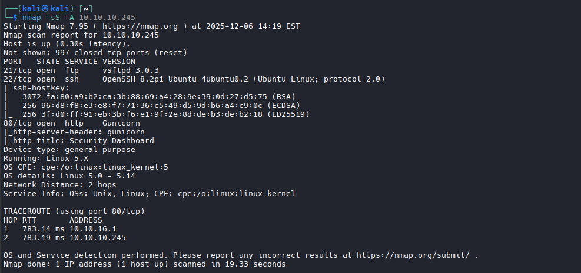
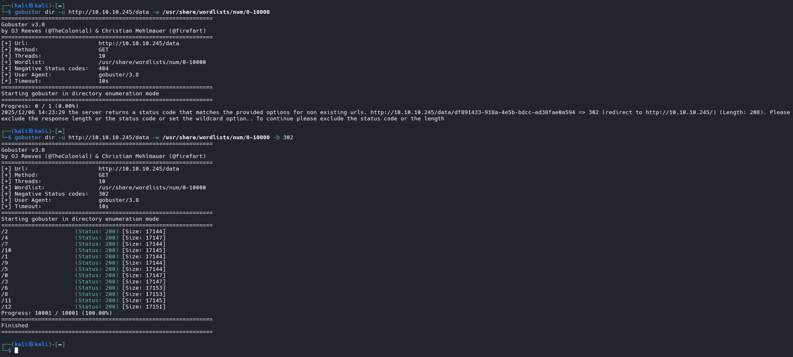
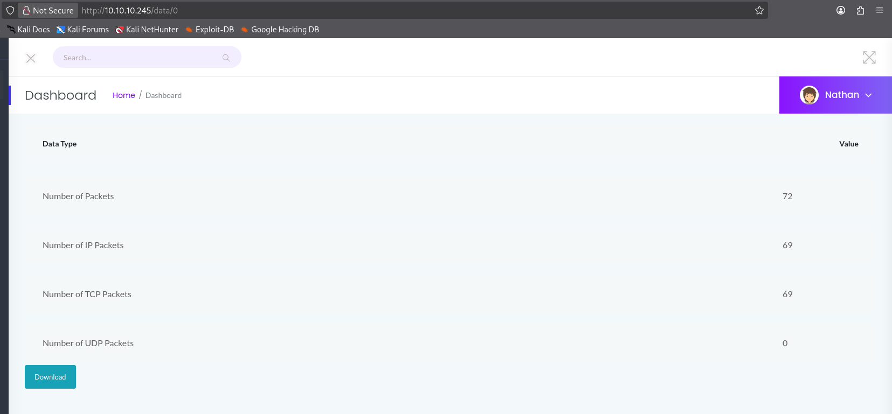
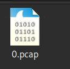
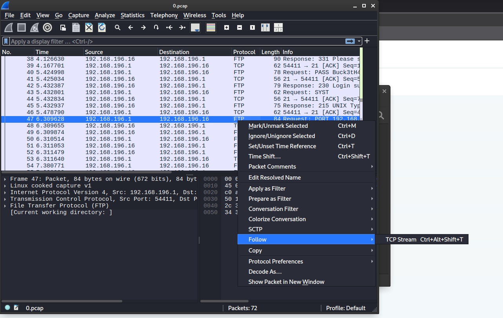
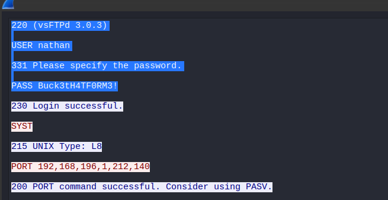
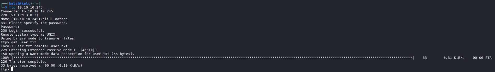
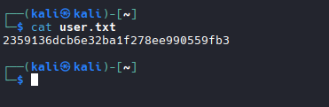
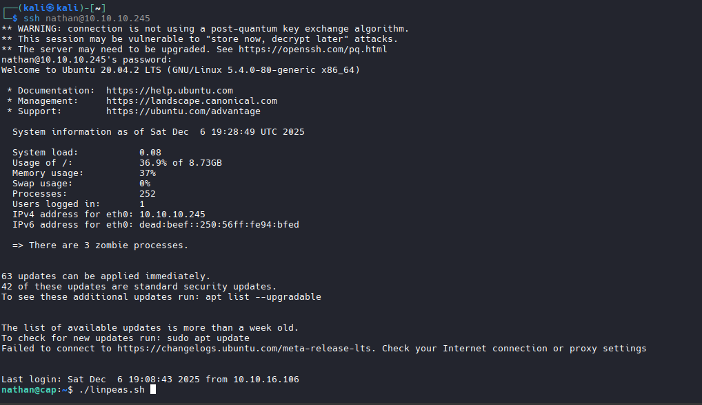
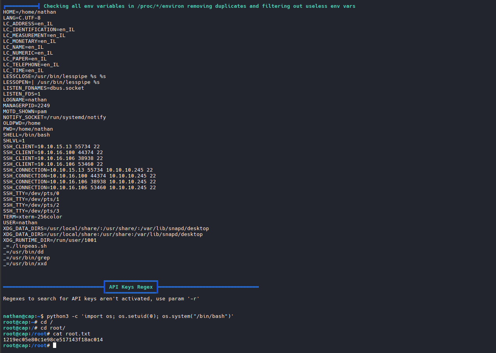

<div align="center">

# HackTheBox - Cap

</div>

<div align="center">
 
## GUÍA COMPLETA EN ESPAÑOL 


  [](#)
  [](#)
  [](#)

</div>

## ÍNDICE

### · RECONOCIMIENTO  
### · ENUMERACIÓN  
### · ANÁLISIS DEL DASHBOARD  
### · ANÁLISIS DEL TRÁFICO  
### · ACCESO INICIAL  
### · ESCALADA DE PRIVILEGIOS  
### · CONCLUSIONES

---

## Reconocimiento

El reconocimiento es la primera y una de las más importantes fases en cualquier prueba de penetración. Consiste en recopilar la mayor cantidad de información posible sobre el objetivo antes de intentar cualquier explotación.

### Escaneo de Puertos con Nmap

Nmap (Network Mapper) es una herramienta de código abierto utilizada para el descubrimiento de redes y auditoría de seguridad. Nos permite identificar qué puertos están abiertos, qué servicios se ejecutan en ellos y sus versiones.

```bash
nmap -sS -A 10.10.10.245
```

**Desglose del comando:**

| Parámetro | Descripción |
|-----------|-------------|
| `nmap` | Invoca la herramienta Nmap |
| `-sS` | **SYN Scan (Half-open scan)**: Envía paquetes SYN y analiza las respuestas. Es más sigiloso que un escaneo completo TCP porque no completa el handshake de tres vías. Si recibe SYN/ACK, el puerto está abierto; si recibe RST, está cerrado |
| `-A` | **Aggressive scan**: Habilita la detección de sistema operativo (`-O`), detección de versiones (`-sV`), escaneo de scripts (`-sC`) y traceroute (`--traceroute`). Es muy útil para obtener información detallada del objetivo |
| `10.10.10.245` | Dirección IP del objetivo |



**Análisis de los resultados:**

| Puerto | Estado | Servicio | Versión | Observaciones |
|--------|--------|----------|---------|---------------|
| 21/tcp | open | FTP | vsftpd 3.0.3 | Servidor FTP que podría permitir transferencia de archivos. FTP transmite credenciales en texto plano |
| 22/tcp | open | SSH | OpenSSH 8.2p1 Ubuntu | Acceso remoto seguro. Útil si conseguimos credenciales válidas |
| 80/tcp | open | HTTP | Gunicorn | Servidor web Python.  |

**Información adicional obtenida:**
- **Sistema Operativo**: Linux 5.x (probablemente Ubuntu basado en el banner de SSH)
- **Distancia de red**: 2 hops
- **Claves SSH**: Se muestran las fingerprints RSA, ECDSA y ED25519

>  **Nota**: El puerto 21 (FTP) es particularmente interesante porque FTP es un protocolo inseguro que transmite credenciales sin cifrar. Si encontramos tráfico FTP capturado, podríamos obtener credenciales.

---

## Enumeración Web

Previamente a la enumeración web, se observa en la web que al acceder al dashboard, se ejecuta desde un directorio data sugieriendo ser un usuario del sistema expuesto en la url y observamos que dependiendo del número que se ponga en la ruta a continucación no descarga un archivo pcap de diferente información, por lo que procedo a lanzar una enumeración de directorios con gobuster para encontrar directorios numéricos posibles.

### Enumeración de Directorios con Gobuster

Gobuster es una herramienta escrita en Go que permite realizar fuerza bruta para descubrir URIs (directorios y archivos), subdominios DNS y nombres de hosts virtuales.

**Primer intento:**
```bash
gobuster dir -u http://10.10.10.245/data -w /usr/share/wordlists/num/0-10000
```

Este primer intento nos muestra que el servidor devuelve código 302 (redirect) para URLs no existentes, lo que interfiere con nuestros resultados. Necesitamos filtrar estas respuestas.

**Comando corregido:**
```bash
gobuster dir -u http://10.10.10.245/data -w /usr/share/wordlists/num/0-10000 -b 302
```

**Desglose del comando:**

| Parámetro | Descripción |
|-----------|-------------|
| `gobuster` | Invoca la herramienta Gobuster |
| `dir` | Modo de enumeración de directorios/archivos. Gobuster también soporta modos `dns` para subdominios y `vhost` para hosts virtuales |
| `-u http://10.10.10.245/data` | **URL base** donde se realizará la enumeración. En este caso, apuntamos directamente al directorio `/data` |
| `-w /usr/share/wordlists/num/0-10000` | **Wordlist**: Archivo que contiene la lista de palabras a probar. Esta wordlist específica contiene números del 0 al 10000, ideal para enumerar IDs numéricos |
| `-b 302` | **Blacklist de códigos de estado**: Excluye las respuestas con código HTTP 302 (redirect). Esto evita falsos positivos cuando el servidor redirige todas las peticiones no válidas |



**Análisis de resultados:**

Gobuster encuentra múltiples endpoints numéricos que devuelven código 200 (OK):

```
/0    (Status: 200) [Size: 17144]
/1    (Status: 200) [Size: 17144]
/2    (Status: 200) [Size: 17147]
/3    (Status: 200) [Size: 17153]
...
/12   (Status: 200) [Size: 17151]
```

Cada uno de estos endpoints (`/data/0`, `/data/1`, etc.) representa una captura de tráfico diferente. El tamaño similar de las respuestas sugiere que todas siguen la misma estructura de página.

> **Hallazgo importante**: La existencia de múltiples IDs numéricos accesibles sugiere una vulnerabilidad **IDOR (Insecure Direct Object Reference)**, donde podemos acceder a recursos de otros usuarios simplemente cambiando el ID en la URL.

---

##  Fase 3: Análisis del Dashboard

### Exploración del Security Dashboard

Accedemos a `http://10.10.10.245/data/0` en el navegador para examinar la aplicación web:



**Observaciones del dashboard:**

| Elemento | Valor | Significado |
|----------|-------|-------------|
| Usuario logueado | Nathan | Identificamos un usuario válido del sistema |
| Number of Packets | 72 | Total de paquetes en esta captura |
| Number of IP Packets | 69 | Paquetes con protocolo IP |
| Number of TCP Packets | 69 | Paquetes TCP (indica tráfico de aplicaciones) |
| Number of UDP Packets | 0 | Sin tráfico UDP en esta captura |
| Botón Download | Presente | Permite descargar el archivo `.pcap` |

**Análisis de la vulnerabilidad IDOR:**

La URL `http://10.10.10.245/data/0` utiliza un identificador numérico (`0`) para acceder a los datos. Al no existir validación de permisos:

1. Cualquier usuario puede acceder a `/data/0`, `/data/1`, `/data/2`, etc.
2. Estas capturas podrían pertenecer a diferentes usuarios o sesiones
3. El archivo `/data/0` resulta particularmente interesante porque contiene la primera captura

### Descarga del Archivo PCAP

Al hacer clic en el botón **"Download"**, obtenemos un archivo llamado `0.pcap`:



---

## Análisis de Tráfico

### Análisis con Wireshark

Wireshark es el analizador de protocolos de red más utilizado en el mundo. Permite capturar y analizar tráfico de red de forma interactiva, mostrando el contenido de cada paquete de manera legible.

Abrimos el archivo `0.pcap` en Wireshark:

```bash
wireshark 0.pcap
```



**Navegación en Wireshark:**

1. **Panel superior**: Lista de paquetes capturados con información resumida
2. **Panel medio**: Detalles del paquete seleccionado (headers de cada capa)
3. **Panel inferior**: Datos en hexadecimal y ASCII

**Identificación de tráfico FTP:**

En la columna "Protocol" observamos múltiples paquetes marcados como **FTP**. El protocolo FTP (File Transfer Protocol) opera en los puertos 20 (datos) y 21 (control), y es conocido por transmitir toda la información **sin cifrar**, incluyendo credenciales.

### Reconstrucción de la Sesión FTP

Para ver la conversación completa entre cliente y servidor FTP, utilizamos la función **"Follow TCP Stream"**:

1. Seleccionamos un paquete FTP
2. Clic derecho → **Follow** → **TCP Stream**

Esta función reconstruye toda la conversación ordenando los paquetes y mostrando los datos de forma legible.

### Credenciales Expuestas



**Contenido del stream TCP:**

```
220 (vsFTPd 3.0.3)
USER nathan
331 Please specify the password.
PASS Buck3tH4TF0RM3!
230 Login successful.
SYST
215 UNIX Type: L8
PORT 192,168,196,1,212,140
200 PORT command successful. Consider using PASV.
```

**Análisis del protocolo FTP:**

| Comando/Respuesta | Significado |
|-------------------|-------------|
| `220 (vsFTPd 3.0.3)` | Banner del servidor FTP indicando la versión |
| `USER nathan` | Cliente envía el nombre de usuario |
| `331 Please specify the password` | Servidor solicita contraseña |
| `PASS Buck3tH4TF0RM3!` | **¡Contraseña en texto plano!** |
| `230 Login successful` | Autenticación exitosa |
| `SYST` | Cliente solicita información del sistema |
| `215 UNIX Type: L8` | Servidor indica que es un sistema UNIX |

**Credenciales descubiertas:**
```
 Usuario: nathan
 Contraseña: Buck3tH4TF0RM3!
```

>  **Vulnerabilidad crítica**: FTP transmite credenciales en texto plano. Cualquier atacante con acceso al tráfico de red (mediante ARP spoofing, acceso al switch, o como en este caso, archivos PCAP expuestos) puede capturar estas credenciales.

---

## Acceso Inicial

### Conexión FTP

Utilizamos las credenciales encontradas para conectarnos al servidor FTP:

```bash
ftp 10.10.10.245
```



**Secuencia de conexión:**

```bash
Connected to 10.10.10.245.
220 (vsFTPd 3.0.3)
Name (10.10.10.245:kali): nathan      # Ingresamos usuario
331 Please specify the password.
Password:                              # Ingresamos: Buck3tH4TF0RM3!
230 Login successful.
Remote system type is UNIX.
Using binary mode to transfer files.
ftp> get user.txt                      # Descargamos la flag
local: user.txt remote: user.txt
229 Entering Extended Passive Mode (|||43310|)
150 Opening BINARY mode data connection for user.txt (33 bytes).
226 Transfer complete.
33 bytes received in 00:00 (0.10 KiB/s)
```

### User Flag

Verificamos el contenido del archivo descargado:

```bash
cat user.txt
```



```
 User Flag: 2359136dcb6e32ba1f278ee990559fb3
```

---

## Escalada de Privilegios

Con acceso como usuario `nathan`, el siguiente objetivo es escalar privilegios para obtener acceso root.

### Conexión SSH

Probamos si las credenciales de FTP también funcionan para SSH (reutilización de contraseñas):

```bash
ssh nathan@10.10.10.245
```


**Información del sistema obtenida:**

```
Welcome to Ubuntu 20.04.2 LTS (GNU/Linux 5.4.0-80-generic x86_64)

System information as of Sat Dec 6 19:28:49 UTC 2025

System load:           0.08
Usage of /:            36.9% of 8.73GB
Memory usage:          37%
Swap usage:            0%
Processes:             252
Users logged in:       1
IPv4 address for eth0: 10.10.10.245
```

>  **Nota**: La reutilización de contraseñas es una práctica muy común pero peligrosa. Una vez comprometida una credencial, el atacante puede probarla en múltiples servicios.

### Enumeración con LinPEAS

LinPEAS (Linux Privilege Escalation Awesome Script) es un script que automatiza la búsqueda de posibles vectores de escalada de privilegios en sistemas Linux.

```bash
./linpeas.sh
```



**Áreas que LinPEAS examina:**

- Información del sistema y kernel
- Servicios y procesos en ejecución
- Archivos con permisos SUID/SGID
- **Capabilities de archivos**
- Tareas cron
- Configuraciones de sudo
- Archivos escribibles por el usuario
- Contraseñas en archivos de configuración
- Y mucho más...

### Vulnerabilidad Encontrada: Python Capabilities

LinPEAS identifica que el binario de Python3 tiene asignada una capability peligrosa:

```
/usr/bin/python3.8 = cap_setuid,cap_net_bind_service+eip
```

**¿Qué son las Linux Capabilities?**

Las capabilities son una forma de dividir los privilegios de root en unidades más pequeñas. En lugar de dar acceso root completo a un programa, se pueden asignar capabilities específicas. Sin embargo, algunas capabilities son tan poderosas que equivalen a tener acceso root.

**La capability `cap_setuid`:**

| Capability | Descripción | Riesgo |
|------------|-------------|--------|
| `cap_setuid` | Permite al proceso cambiar su UID (User ID) | **CRÍTICO**: Puede cambiar a UID 0 (root) |
| `cap_net_bind_service` | Permite bindear puertos por debajo de 1024 | Bajo riesgo por sí solo |


### Explotación de cap_setuid

Con la capability `cap_setuid` en Python, podemos cambiar nuestro UID a 0 (root) y ejecutar una shell:

```bash
python3 -c 'import os; os.setuid(0); os.system("/bin/bash")'
```

**Desglose detallado del comando:**

| Parte | Descripción |
|-------|-------------|
| `python3` | Intérprete de Python 3 |
| `-c` | Ejecuta el código Python pasado como string |
| `import os` | Importa el módulo `os` que proporciona funciones del sistema operativo |
| `os.setuid(0)` | Cambia el UID del proceso actual a 0 (root). Esto es posible gracias a `cap_setuid` |
| `os.system("/bin/bash")` | Ejecuta `/bin/bash` como subproceso. Como el UID ahora es 0, la shell será root |

**¿Por qué funciona este exploit?**

1. Normalmente, solo root (UID 0) puede usar `setuid()` para cambiar a cualquier usuario
2. La capability `cap_setuid` otorga este privilegio específico a Python
3. Al ejecutar `os.setuid(0)`, Python cambia su UID a root
4. Cualquier proceso hijo (como `/bin/bash`) hereda este UID
5. Resultado: obtenemos una shell con privilegios de root

### Root Flag

Una vez con shell de root, navegamos al directorio home de root:

```bash
cd /root
cat root.txt
```


```
 Root Flag: 1219ec05e80c1e98ce517143f18ac014
```

---

## Conclusión

### Resumen de la Explotación

La máquina **Cap** de Hack The Box presenta un escenario realista que demuestra cómo múltiples vulnerabilidades de seguridad, aunque individualmente podrían parecer menores, pueden encadenarse para lograr un compromiso total del sistema.

### Vulnerabilidades Explotadas

#### 1. IDOR (Insecure Direct Object Reference) - Severidad: Media

**¿Qué es?**
IDOR ocurre cuando una aplicación expone referencias directas a objetos internos (como IDs de base de datos, nombres de archivos, etc.) sin validar si el usuario tiene autorización para accederlos.

**En esta máquina:**
- El dashboard de seguridad usa URLs como `/data/0`, `/data/1`, etc.
- No existe validación de que el usuario tenga permiso para ver cada captura
- Cualquier usuario puede acceder a capturas de tráfico de otros usuarios simplemente cambiando el número en la URL

**Impacto:**
- Acceso no autorizado a información sensible
- En este caso, permitió acceder a capturas de red que contenían credenciales

**Mitigación:**
- Implementar control de acceso basado en sesión
- Usar identificadores no predecibles (UUIDs en lugar de números secuenciales)
- Validar permisos del usuario antes de mostrar cualquier recurso

---

#### 2. Transmisión de Credenciales en Texto Plano (FTP) - Severidad: Alta

**¿Qué es?**
FTP (File Transfer Protocol) es un protocolo diseñado en 1971, antes de que la seguridad fuera una preocupación. Transmite todo el tráfico, incluyendo usuario y contraseña, sin ningún tipo de cifrado.

**En esta máquina:**
- Las credenciales `nathan:Buck3tH4TF0RM3!` fueron capturadas en tráfico FTP
- El archivo PCAP contenía la sesión completa de autenticación
- Cualquier persona con acceso al tráfico de red puede leer las credenciales

**Impacto:**
- Compromiso de credenciales mediante sniffing de red
- Posibilidad de ataques Man-in-the-Middle

**Mitigación:**
- Reemplazar FTP por SFTP (SSH File Transfer Protocol) o FTPS (FTP sobre TLS)
- Nunca usar protocolos sin cifrado para transmitir datos sensibles
- Implementar segmentación de red y cifrado a nivel de red (VPN)

---

#### 3. Reutilización de Contraseñas - Severidad: Alta

**¿Qué es?**
Usar la misma contraseña para múltiples servicios o sistemas. Cuando una credencial es comprometida, el atacante puede probarla en otros servicios.

**En esta máquina:**
- La contraseña de FTP (`Buck3tH4TF0RM3!`) también funcionaba para SSH
- Un solo punto de compromiso dio acceso a múltiples servicios

**Impacto:**
- Amplificación del impacto de una brecha de seguridad
- Facilita el movimiento lateral del atacante

**Mitigación:**
- Usar contraseñas únicas para cada servicio
- Implementar gestores de contraseñas
- Considerar autenticación multifactor (MFA)
- Usar autenticación basada en certificados SSH

---

#### 4. Mala Configuración de Linux Capabilities - Severidad: Crítica

**¿Qué es?**
Las Linux Capabilities dividen los privilegios de root en unidades más pequeñas. Sin embargo, ciertas capabilities como `cap_setuid` son equivalentes a tener acceso root completo.

**En esta máquina:**
- Python3 tenía asignada la capability `cap_setuid`
- Esto permitió a cualquier usuario ejecutar `os.setuid(0)` para convertirse en root
- Un simple comando de Python fue suficiente para escalar privilegios

**Impacto:**
- Escalada de privilegios trivial a root
- Compromiso total del sistema
- Cualquier usuario local podía obtener acceso administrativo

**Mitigación:**
- Solo asignar capabilities cuando sea absolutamente necesario
- Considerar alternativas como sudo con reglas específicas
- Usar herramientas de auditoría como LinPEAS periódicamente

---

### Cadena de Ataque Completa

```
Vulnerabilidad IDOR          Credenciales FTP        Reutilización         cap_setuid
    en el Dashboard     →    en texto plano     →    de contraseñas   →    en Python
         │                        │                       │                    │
         ▼                        ▼                       ▼                    ▼
   Acceso a PCAP           Captura de creds         Acceso SSH            Root Shell
    de otros usuarios      nathan:Buck3tH4TF0RM3!   como nathan           GAME OVER
```

### Lecciones Aprendidas

1. **Defensa en profundidad**: Una sola capa de seguridad no es suficiente. Si cualquiera de las vulnerabilidades hubiera sido mitigada, el ataque habría sido significativamente más difícil.

2. **Principio de mínimo privilegio**: El binario de Python no necesitaba `cap_setuid`. Asignar permisos excesivos crea vectores de ataque innecesarios.

3. **Cifrado en tránsito**: Cualquier protocolo que transmita datos sensibles debe usar cifrado. FTP debería ser reemplazado por alternativas seguras.

4. **Validación de autorización**: Cada solicitud de recurso debe validar que el usuario tiene permiso para accederlo, no solo que está autenticado.

5. **Monitoreo y auditoría**: Herramientas como LinPEAS existen porque las malas configuraciones son comunes. Las organizaciones deberían realizar auditorías similares proactivamente.

---

<div align="center">
  
# DISCLAIMER

Este writeup es SOLO para propósitos educativos.  
Úsalo responsablemente en entornos autorizados como HackTheBox.  

**Autor:** pablocaraballofernandez  
**Plataforma:** HackTheBox

</div>


<div align="center">
  
  [](https://www.linkedin.com/in/pablo-caraballo-fern%C3%A1ndez-a12938358/)
  [](https://tryhackme.com/p/CyberPablo)
  [](https://ctf.hackthebox.com/user/profile/872564)
  .[](https://cyberdefenders.org/p/cybersecpcarfer)
  
</div>


